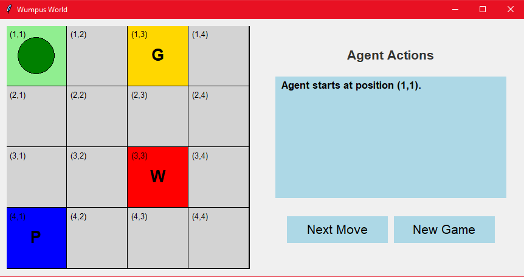
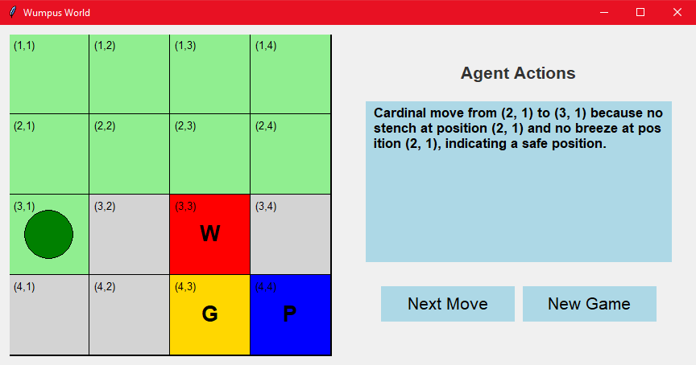

# 🐍 WumpusWorld

An interactive simulation of the classic **Wumpus World** problem using Python and `tkinter`. This project demonstrates basic AI decision-making in a partially observable environment. The agent must safely navigate the world, find the gold, avoid pits and the Wumpus, and return home.

---

## 🎮 Game Explanation

Wumpus World is a 4x4 grid-based environment in which:

- There is **one agent**, starting at the bottom-left cell.
- The goal is to **find the gold**, avoid dangers, and **return to the starting cell**.
- The world contains:
  - **Wumpus** (a monster): Entering its cell kills the agent.
  - **Pits**: Falling into a pit also kills the agent.
  - **Gold**: The agent wins by grabbing it and returning home.
- The agent receives **perceptions** in each cell:
  - **Stench**: Indicates a Wumpus is in an adjacent cell.
  - **Breeze**: Indicates a Pit is in an adjacent cell.
- The agent can shoot **one arrow** to kill the Wumpus, but must guess its location.
- The environment is randomly generated at the start of each game.

---

## 🚀 Features

- ✅ 4x4 Grid World with random hazard and gold placement  
- 🧠 Intelligent agent with DFS-based navigation and decision-making  
- 🕳️ Real-time breeze and stench feedback  
- 🏹 One arrow for eliminating the Wumpus  
- 💰 Gold collection and return logic  
- 📜 Log of agent actions with reasoning  
- 🎨 Simple GUI built with `tkinter`  
- 🔄 Reset/New Game button  

---

## 🖼️ Screenshot





---

## 📦 Installation

1. **Clone the repository**:
   ```bash
   git clone https://github.com/mohammad-majoony/WumpusWorld.git
   cd WumpusWorld

2. **Run the GUI**:

   ```bash
   pip install -r requirements.txt
   python main.py
   ```

## ✨ Future Improvements

* Add smarter probabilistic reasoning for dangerous cells
* Sound effects and animation
* Support for different grid sizes or difficulty levels
* Ability to save and replay past games

```